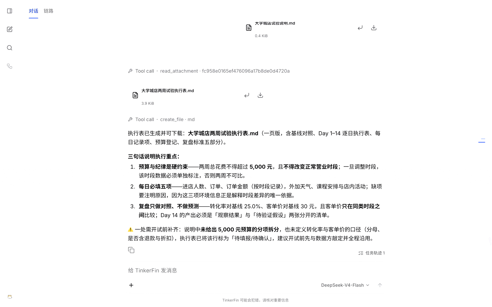
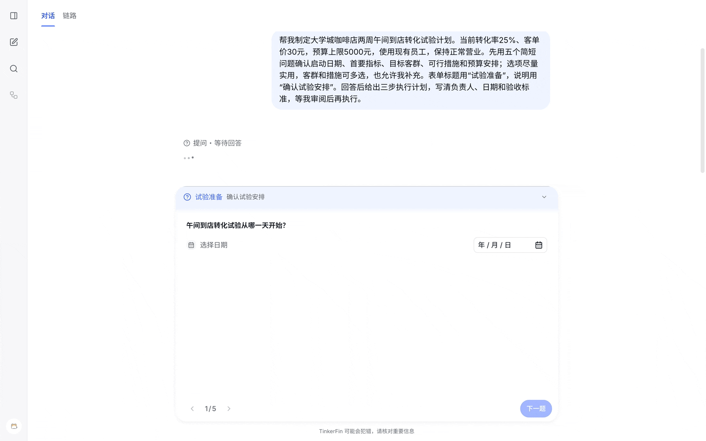
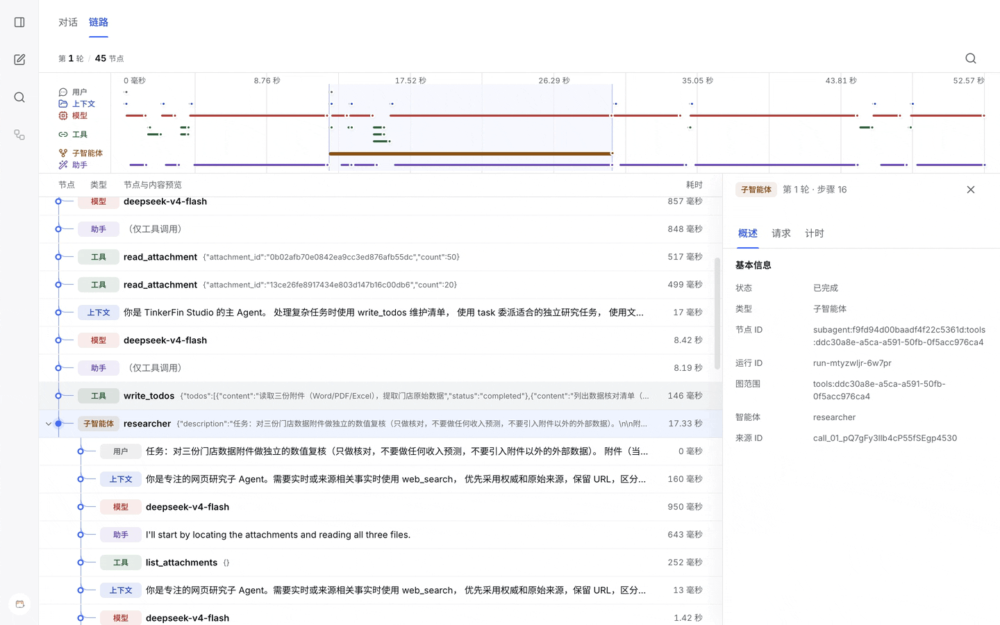

<p align="center">
  
</p>
<h1 align="center">TinkerFin</h1>
<p align="center"><strong>面向企业级智能体应用与业务工作流的 Python Agent Harness</strong></p>
<p align="center">
  <a href="README.md">English</a> · <a href="README.cn.md">简体中文</a> ·
  <a href="docs/cn/index.md">Documentation</a> · <a href="docs/cn/quick_start.md">Quick Start</a>
</p>
<p align="center">
  <a href="docs/cn/runtime/quick_start.md"></a>
  <a href="https://docs.langchain.com/oss/python/deepagents/overview"></a>
  <a href="https://docs.langchain.com/oss/python/langchain/overview"></a>
  <a href="LICENSE"></a>
  <a href="https://github.com/tinkerfin-ai/tinkerfin-harness/actions/workflows/packages-quality.yml"></a>
  <a href="docs/cn/index.md"></a>
</p>

## 项目说明

**TinkerFin 是面向企业级应用的 Python Agent Harness。** 它连接模型、工具和工作区，
提供多模态输入、任务编排、持久状态、人工审批与执行追踪。

既可独立运行智能体，也可与业务工作流组合，用于调研分析、文档处理、数据分析和文件生成。



## 安装

安装 Python 框架和要使用的模型集成：

```bash
pip install tinkerfin langchain-openai
```

Studio 使用 Docker 与 Docker Compose，[Studio 上手指南](docs/cn/studio/quick_start.md)
说明所需服务和配置。

## 快速开始

### 体验 Studio

通过 Docker Compose 启动后端，再单独启动 Web 客户端。初始账号为 `tinkerfin`，密码为 `123456`；登录后配置自己的模型。

[打开 Studio 上手指南 →](docs/cn/studio/quick_start.md)

### 接入 Python 框架

需要 Python 3.11 或更高版本。配置模型密钥后，通过 `TinkerFin().with_namespace(...).build(...)` 构建
`AgentRuntime` 并接收执行结果。

[运行第一个智能体 →](docs/cn/runtime/quick_start.md)

## 核心能力

- **按需组合 Harness 能力** — 配置模型、工具、技能和子智能体，按需组合运行管理、消息、追踪与沙箱能力。
- **搭配业务工作流使用** — 在应用工作流中调用智能体，或将编译后的 LangGraph 工作流注册为子智能体，组合固定步骤与模型驱动的工具调用。
- **多模态输入与文件交付** — 传递图片、音频、视频和文档附件，结合支持相应格式的模型与工具完成处理，并交付生成的文件。
- **计划审阅与工具审批** — 先澄清需求、审阅计划，再进入执行；关键工具操作可单独审批。
- **实时事件与断线续传** — 通过持久消息通道推送与回放 AG-UI 事件，业务事件可共用同一通道。
- **追踪每次调用** — 查看模型、工具和子智能体的调用关系、输入输出与耗时，实时跟踪或查询历史。
- **管理隔离工作区** — 读写文件、执行命令，支持环境复用、预热、暂停和恢复。
- **持久状态与运行协调** — 保存会话状态并在审批后继续执行，协调多进程下的运行归属、重复请求与取消。
- **多租户集成** — 按租户、用户或项目划分会话、存储与沙箱范围；认证和访问授权由应用负责。
- **后台任务调度** — 立即执行任务，或设置一次性、固定速率和 Cron 调度；通过 [Automation](docs/cn/automation/index.md) 查询结果、取消执行或发起重试。

## Studio：支持多模态的智能体工作台

用文字、图片和文档发起任务，在对话中完成分析、生图与文件交付。看图和生图需配置相应模型。

### 将业务目标转为执行计划

业务目标先转成可审阅的计划，确认范围和步骤后再进入执行。



### 掌握任务执行过程

从业务对话一路追踪到模型、工具和子智能体，查看任务如何执行、时间花在哪里。



*使用门店示例数据在 Studio 中实际录制。*

## 项目组成

| 部分 | 用途 |
| --- | --- |
| `packages/` | 企业级 Agent Harness 框架包，提供执行、持久化、消息、人工审阅、追踪与工作区能力 |
| `apps/studio/` | Studio 工作台，提供会话、计划审阅、文件与追踪界面 |
| `docs/` | 覆盖应用搭建、部署运维与深度集成的双语文档 |

## 文档

[中文文档首页 →](docs/cn/index.md)

从应用搭建到部署运维，提供上手指南、架构说明与集成参考。

## 参与贡献

欢迎提交问题、改进文档或贡献代码。开发环境和验证命令见[开发指南](docs/cn/development.md)。

- [参与开发](docs/CONTRIBUTING.cn.md)
- [安全漏洞报告](SECURITY.md)

## 许可证

仓库默认采用 [Apache License 2.0](LICENSE)。
`tinkerfin-langgraph-store` 采用包内 [MIT License](packages/tinkerfin-langgraph-store/LICENSE)
与 [NOTICE](packages/tinkerfin-langgraph-store/NOTICE)。
