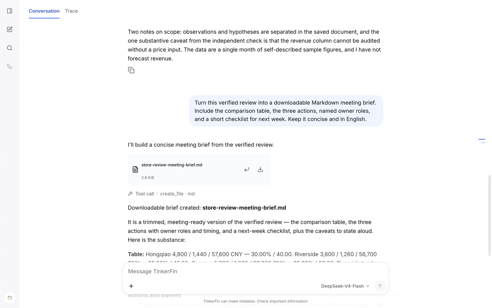
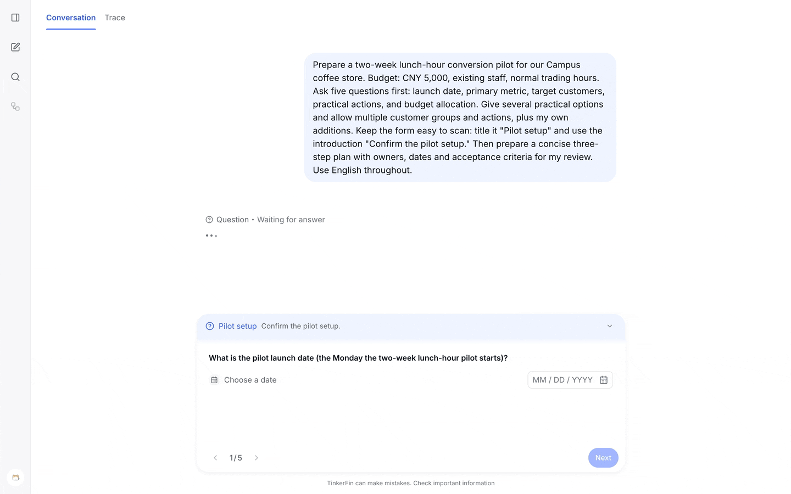
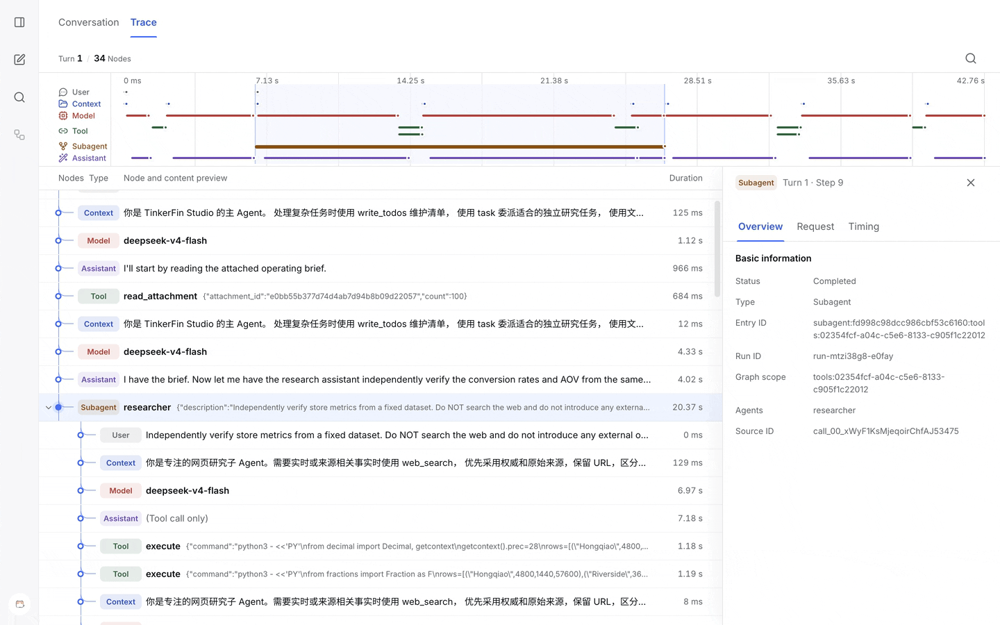

<p align="center">
  
</p>
<h1 align="center">TinkerFin</h1>
<p align="center"><strong>A Python agent harness for enterprise applications and workflows.</strong></p>
<p align="center">
  <a href="README.md">English</a> · <a href="README.cn.md">简体中文</a> ·
  <a href="docs/en/index.md">Documentation</a> · <a href="docs/en/quick_start.md">Quick Start</a>
</p>
<p align="center">
  <a href="docs/en/runtime/quick_start.md"></a>
  <a href="https://www.typescriptlang.org/"></a>
  <a href="https://docs.langchain.com/oss/python/deepagents/overview"></a>
  <a href="https://docs.langchain.com/oss/python/langchain/overview"></a>
  <a href="https://fastapi.tiangolo.com/"></a>
  <a href="https://github.com/opensandbox-group/OpenSandbox"></a>
  <a href="LICENSE"></a>
  <a href="docs/en/index.md"></a>
</p>

## What it is

**TinkerFin is a Python agent harness for enterprise applications.** It connects
models, tools, and workspaces, with multimodal input, task orchestration, persistent
state, human approval, and execution tracing.

Run agents independently or combine them with business workflows for research,
document processing, data analysis, and file generation.



## Installation

Install the Python framework and the model integration you plan to use:

```bash
pip install tinkerfin langchain-openai
```

For Studio, use Docker Compose for dependencies and Python with uv for the local backend. The [Studio setup guide](docs/en/studio/quick_start.md)
covers the required services and configuration.

## Quick Start

### Try Studio

Run `./apps/studio/server/deploy/start.sh --local` to prepare dependencies and local configuration, then start the backend and Web client. Container deployment is also supported. Sign in with the initial username `tinkerfin` and password `123456`, then configure your model.

[Open the Studio setup guide →](docs/en/studio/quick_start.md)

### Build with Python

Requires Python 3.11 or newer. Set your model credentials, then build an `AgentRuntime` with
`TinkerFin().with_namespace(...).build(...)`, and consume its output.

[Run your first agent →](docs/en/runtime/quick_start.md)

## Core concepts

- **Compose your agent harness** — Configure models, tools, skills, and subagents. Add execution management, messaging, tracing, and sandbox capabilities as needed.
- **Connect agents and workflows** — Invoke agents from application workflows, or register compiled LangGraph workflows as subagents to combine predefined steps with model-directed tool use.
- **Multimodal input and file delivery** — Pass images, audio, video, and documents to models and tools that support their formats, and return generated files.
- **Review plans and tool operations** — Clarify requirements and approve a plan before execution. Selected tool operations can require separate approval.
- **Stream and replay events** — Deliver AG-UI events through persistent message channels and replay after reconnection. Application events can use the same channels.
- **Trace each call** — Inspect model, tool, and subagent relationships, inputs, outputs, and timing, live or from past runs.
- **Manage isolated workspaces** — Read and write files, execute commands, and reuse, prewarm, pause, or resume environments.
- **Persist state and coordinate runs** — Retain conversation state and continue after approval. Coordinate run ownership, duplicate requests, and cancellation across processes.
- **Multitenant integration** — Scope conversations, storage, and sandboxes by tenant, user, or project. Applications own authentication and access authorization.
- **Schedule background tasks** — Run operations immediately or on one-time, fixed-rate, and Cron schedules. Query results, cancel executions, and request retries through [Automation](docs/en/automation/index.md).

## Studio: a multimodal agent workspace

Start tasks with text, images, and documents. Analyze content, generate images, and receive files in the same conversation. Image understanding and generation require the corresponding models to be configured.

### Turn business goals into execution plans

Turn a business goal into a reviewable plan, then confirm the scope and steps before execution.



### Understand how each task runs

Follow a business conversation through model calls, tools, and subagents to see how the task ran and where time was spent.



*Recorded in Studio with sample store data.*

## Project layout

| Part | Purpose |
| --- | --- |
| `packages/` | Enterprise agent harness packages for execution, persistence, messaging, human review, tracing, and workspaces |
| `apps/studio/` | Studio interface for conversations, plan review, files, and traces |
| `docs/` | Bilingual documentation for application development, deployment, operations, and advanced integration |

## Documentation

[English documentation →](docs/en/index.md)

From application development to deployment and operations: getting-started guides, architecture documentation, and integration references.

## Contributing

Issue reports, documentation improvements, and code contributions are welcome. See the [development guide](docs/en/development.md) for environment setup and validation commands.

- [Contributing](CONTRIBUTING.md)
- [Security reports](SECURITY.md)

## License

[Apache License 2.0](LICENSE) is the repository default. `tinkerfin-langgraph-store` uses its packaged
[MIT License](packages/tinkerfin-langgraph-store/LICENSE) and [NOTICE](packages/tinkerfin-langgraph-store/NOTICE).
