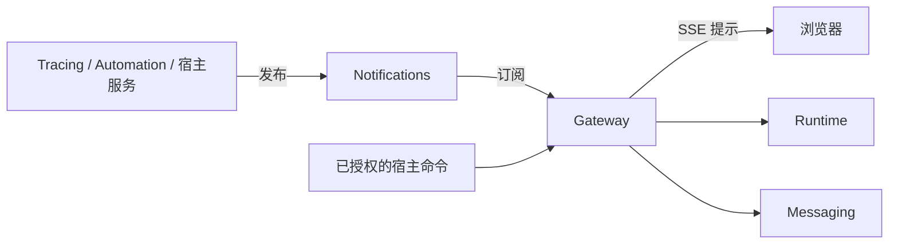

# 受理命令并通知客户端

[文档首页](../index.md) · [English](../../en/gateway/index.md)

`tinkerfin-gateway` 受理经过授权的 Runtime 命令，提供持久输出订阅和资源变化通知。它借用 Messaging 与 Notifications；应用负责这些资源的生命周期、认证和传输路由。Gateway 不启动服务器，也不拥有数据库。

## 发起运行

```bash
pip install tinkerfin-gateway
```

```python
from tinkerfin import TinkerFin
from tinkerfin_gateway import Gateway, StartRun
from tinkerfin_messaging import Messaging
from tinkerfin_notifications import Notifications


async def answer(model):
    runtime = TinkerFin().with_namespace("authorized-account").build(model)
    async with Notifications() as notifications, Messaging() as messaging:
        gateway = Gateway(messaging=messaging, notifications=notifications)
        run = await gateway.start(
            runtime,
            StartRun(
                thread_id="conversation",
                run_id="request-id",
                messages=({"id": "question", "role": "user", "content": "Hello"},),
            ),
        )
        async with run.subscribe() as replies:
            async for reply in replies:
                print(reply.envelope.seq, reply.data.type)
```

两个共享服务应覆盖整个应用生命周期。`start` 在没有输出消费者时也能受理执行。关闭订阅只断开当前读取者；需要停止执行时，显式调用 `await run.cancel()`。

每次用户操作生成一个运行 ID，重试时复用。Messaging 记录保留期间，同一运行身份绑定完整命令，包括消息或审批决定、父运行、模式和 JSON 执行参数；内容不一致时抛出 `RunRequestConflict`。记录删除或保留期结束后，这项保证也随之结束。模型、工具、命名空间与输入资源的授权仍由宿主负责。

## 提供已授权的上下文

在 `StartRun.messages` 中分别放入用户原文和应用提供的指令，并将后者标记为
`source.kind="context"`：

```python
from tinkerfin_gateway import StartRun


async def answer_with_context(gateway, runtime, user_text, instructions):
    run = await gateway.start(
        runtime,
        StartRun(
            thread_id="conversation",
            run_id="request-with-context",
            messages=(
                {"id": "question", "role": "user", "content": user_text},
                {
                    "id": "reference",
                    "role": "user",
                    "content": instructions,
                    "source": {
                        "kind": "context",
                        "name": "retrieval",
                        "metadata": {"document": "authorized-report"},
                    },
                },
            ),
        ),
    )
    async with run.subscribe() as replies:
        async for reply in replies:
            print(reply.data.type)
```

应用负责授权正文并提供稳定的消息 ID。框架将两条消息及其来源保留在 checkpoint
和历史中，Plan 和会话轮次关联用户原文。上下文随正常的历史清理或压缩移除，
模型角色仍为 `user`。省略来源或使用 `source.kind="user"` 表示用户消息；
`name` 和 `metadata` 是可选的公开来源信息，由 `tinkerfin_contracts.MessageSource`
校验，不应包含密钥。重复请求使用相同的完整消息，恢复暂停任务时只提交恢复决定。

## 选择操作

| API | 结果 |
| --- | --- |
| `start(runtime, StartRun(...))` | 受理新对话命令，返回绑定身份的运行句柄 |
| `resume(runtime, ResumeRun(...))` | 受理完整的 `AgUiResumeRequest`，继续已保存的工作 |
| `compact(runtime, CompactRun(...))` | 整理已保存的会话上下文 |
| `stream(runtime, command, after=...)` | 受理命令，返回这次受理的原始对象订阅 |
| `run(authorized_identity)` | 绑定已有身份，无需构建 Runtime |
| `run.subscribe(after=0)` | 重播并跟随有类型的输出 |
| `run.cancel()` | 请求取消并等待结算 |
| `run.delivery_status()` | 查询持久投递状态；执行结果通过 Tracing 查询 |

`StartRun` 和 `ResumeRun` 的 JSON `parameters` 会传给 Runtime 的 `configurable` 设置。Gateway 命令不表示任意 Runtime 上下文对象，也不覆盖所有顶层图配置。凭据应保存在已授权的应用资源中。Gateway 的稳定 `name` 标识多个工作进程与重启之间共用的 Messaging 频道。

即时输出使用 `stream`。先启动运行，再调用 `subscribe`，属于另一次重播读取。返回的输出订阅由调用方负责，即使没有开始消费也必须关闭。不使用 HTTP 的宿主也能调用同一组命令与对象流接口。

## 通过 HTTP 发送输出

```bash
pip install "tinkerfin-gateway[starlette]"
```

```python
from tinkerfin_gateway.starlette import sse_response


async def send_command(gateway, authorized_runtime, command, request):
    return await sse_response(
        gateway.stream(authorized_runtime, command), request=request
    )
```

宿主定义路由并授权参数。受理与游标检查在发送响应头前完成。响应在正常结束、响应头发送失败、取消或断连时关闭读取资源；准备好的响应如果不再发送，应调用 `await response.aclose()`。不要在返回响应前关闭它使用的流。读取完请求体后传入 `request`，准备阶段也会随断连取消；省略时，宿主需取消已放弃的准备操作。请求为借用资源，关闭读取不会取消已接受的持久运行。

## 通知浏览器读取资源变化

```python
from tinkerfin_gateway.starlette import sse_response
from tinkerfin_notifications import NotificationScope


async def changes(gateway, account_id, expires_at, check_access):
    return await sse_response(
        gateway.notifications(
            scopes=[NotificationScope("application", owner_id=account_id)],
            expires_at=expires_at,
            authorize=check_access,
        )
    )
```

`account_id` 和带时区的固定 `expires_at` 来自宿主认证。`check_access` 是返回当前访问是否仍被授权的异步函数，每次只执行有界的短操作。不要在回调中保留请求级数据库会话，也不要接受客户端传入的命名空间或拥有者筛选条件。开始发送前以及每隔 15 秒复核权限，发送停顿后也会按期限检查；到期或撤销权限后结束流。

| SSE 事件 | 客户端操作 |
| --- | --- |
| `ready` | 订阅已生效，读取权威基线 |
| `change` | 根据 Notification 内容标记对应资源需要刷新 |
| `resync` | 重新读取可见资源，补齐溢出或连接中断期间的变化 |

宿主要求认证头时，使用携带 Bearer 凭据的 fetch 流。每个可见标签页共享一条通知连接，合并重复失效提示，同一资源的查询依次执行。断连后重建连接并读取基线。通知属于提示，仍需周期校准；智能体回复使用单独的运行输出流。

资源已提供绑定作用域的订阅入口时，使用 `resource_changes`：

```python
async def workspace_changes(
    gateway, authorized_project, expires_at, check_access, request
):
    return await sse_response(
        gateway.resource_changes(
            watch_changes=authorized_project.watch,
            expires_at=expires_at,
            authorize=check_access,
        ),
        request=request,
    )
```

宿主选择已授权的资源，并提供对应的权威查询。`watch_changes` 遵循导出的 `ResourceChangeWatch`
契约：进入异步上下文即完成订阅，其迭代器返回不超过 1,024 个 UTF-8 字节的字符串提示或
`ResyncRequired`。Gateway 持有该上下文直到流关闭，沿用资源通知的鉴权、到期、取消及响应清理。
字符串提示会成为 `change` 事件的数据，例如 `{"kind":"files_changed"}`；客户端应等到 `ready`
再发起初次查询。资源的管理器由宿主持有，必须在流结束前保持开启；是否允许观察尚不存在或已暂停的
资源由订阅源决定。Gateway 不依赖 Sandbox。

## 接入业务登记与观察

宿主保存自己的业务状态时，可以使用以下可选职责：

| 扩展点 | 宿主负责的事项 |
| --- | --- |
| `RunRegistration.confirm(acceptance)` | 确认新执行已受理或已附着到已有命令，通过 `acceptance.kind` 区分 |
| `RunRegistration.release()` | 只释放本次提交尚未受理的预登记 |
| `ResumeSettlement.saved(receipt)` | 幂等记录审批决定已保存 |
| `ResumeSettlement.not_saved()` | 只有 Runtime 明确未保存决定时才释放认领 |
| `on_committed(event)` | 观察已持久化的主运行开始与终止，重播不重复触发 |
| `RunPresentation(...)` | 补充固定的开始属性和取消文案，不覆盖协议字段 |

提交前绑定业务身份和预登记的归属。其他请求可能已经使用同一登记，失败请求不能删除共享的已受理状态。两种受理结果均不代表工作区已就绪、Graph 已准备完成或恢复决定已保存；确认失败时保留业务登记，供后续按权威事实核对。未使用的重试源或无法确认的检查点结果可能不调用任何审批结算方法，不能把没有回调当作未保存。

观察者可能在请求结束后继续执行，失败也不能撤销已经提交的输出。这些操作应借用应用级资源，并在需要时开启短事务。

## 职责与依赖



Tracing 与 Automation 依赖 Notifications，可以独立于 Gateway 使用。Notifications 不依赖消费者。Gateway 通过公共契约组合 Runtime、Messaging 与通知能力，Core 保持与服务器无关。多个进程之间使用共享的 Messaging 存储和 Redis 通知频道；业务持久化与权限仍归应用负责。
