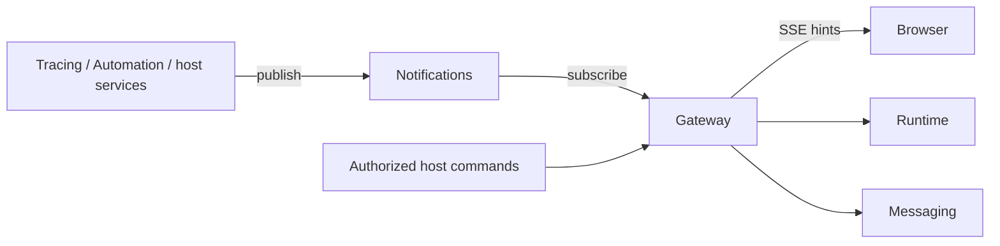

# Accept commands and notify clients

[Documentation](../index.md) · [中文](../../cn/gateway/index.md)

`tinkerfin-gateway` accepts authorized Runtime commands, provides durable output,
and exposes resource-change notifications. It borrows Messaging and Notifications;
the application owns their lifecycles, authentication, and transport routes.
Gateway opens no server and owns no database.

## Run a command

```bash
pip install tinkerfin-gateway
```

```python
from tinkerfin import TinkerFin
from tinkerfin_gateway import Gateway, StartRun
from tinkerfin_messaging import Messaging
from tinkerfin_notifications import Notifications


async def answer(model):
    runtime = TinkerFin().with_namespace("authorized-account").build(model)
    async with Notifications() as notifications, Messaging() as messaging:
        gateway = Gateway(messaging=messaging, notifications=notifications)
        run = await gateway.start(
            runtime,
            StartRun(
                thread_id="conversation",
                run_id="request-id",
                messages=({"id": "question", "role": "user", "content": "Hello"},),
            ),
        )
        async with run.subscribe() as replies:
            async for reply in replies:
                print(reply.envelope.seq, reply.data.type)
```

Keep both shared services open for the application lifetime. `start` accepts
execution even if no output consumer attaches. Closing a subscription detaches
that reader; `await run.cancel()` requests cancellation explicitly.

Generate one run ID per user action and reuse it for retries. While its Messaging
record is retained, the run identity is bound to the complete command: messages or
decisions, parent run, mode, and JSON execution parameters. Changed content raises
`RunRequestConflict`. Deletion or retention expiry ends this guarantee. The host
continues to authorize model choices, tools, namespaces, and input resources.

## Include authorized context

Keep the person's text and host-provided instructions as separate entries in
`StartRun.messages`. Mark the latter with `source.kind="context"`:

```python
from tinkerfin_gateway import StartRun


async def answer_with_context(gateway, runtime, user_text, instructions):
    run = await gateway.start(
        runtime,
        StartRun(
            thread_id="conversation",
            run_id="request-with-context",
            messages=(
                {"id": "question", "role": "user", "content": user_text},
                {
                    "id": "reference",
                    "role": "user",
                    "content": instructions,
                    "source": {
                        "kind": "context",
                        "name": "retrieval",
                        "metadata": {"document": "authorized-report"},
                    },
                },
            ),
        ),
    )
    async with run.subscribe() as replies:
        async for reply in replies:
            print(reply.data.type)
```

The host authorizes the content and supplies stable message IDs. Runtime preserves
both messages and their provenance in checkpoints and recorded history; Plan and
Turn association use the person's request. Context remains until normal history
removal or compaction. The model role is still `user`. An absent source or
`source.kind="user"` denotes a person's message; `name` and `metadata` are optional,
public origin details validated by `tinkerfin_contracts.MessageSource`. Do not put
secrets in provenance. Pass the same complete messages on retries and only resume
decisions when continuing interrupted work.

## Select an operation

| API | Result |
| --- | --- |
| `start(runtime, StartRun(...))` | Accept a new conversation command and return a bound run handle |
| `resume(runtime, ResumeRun(...))` | Accept a complete `AgUiResumeRequest` and continue saved work |
| `compact(runtime, CompactRun(...))` | Compress the saved conversation context |
| `stream(runtime, command, after=...)` | Accept a command and return its original object subscription |
| `run(authorized_identity)` | Bind an existing identity without building a Runtime |
| `run.subscribe(after=0)` | Replay and follow typed output |
| `run.cancel()` | Request cancellation and wait for settlement |
| `run.delivery_status()` | Read durable delivery state; use Tracing for execution results |

`StartRun` and `ResumeRun` accept JSON `parameters`, passed to Runtime's
`configurable` settings. A Gateway command does not represent arbitrary Runtime
context objects or every top-level graph option. Credentials belong in authorized
application resources. The stable Gateway `name` identifies the Messaging channel
shared by workers and restarts.

For immediate delivery use `stream`. Starting a run and later calling `subscribe`
selects replay behavior; it is a separate consumption choice. Output subscriptions
are caller-owned and must be closed even if they are never consumed. The same
command and object-stream APIs are available to hosts that do not use HTTP.

## Send output over HTTP

```bash
pip install "tinkerfin-gateway[starlette]"
```

```python
from tinkerfin_gateway.starlette import sse_response


async def send_command(gateway, authorized_runtime, command, request):
    return await sse_response(
        gateway.stream(authorized_runtime, command), request=request
    )
```

The host defines the route and authorizes its arguments. Admission and cursor
checks finish before response headers are sent. The response closes its readers
on completion, failed headers, cancellation, or disconnect. If it will not be sent,
call `await response.aclose()`. Do not close the prepared stream before returning
its response. Pass `request` after consuming its body to cancel preparation on
disconnect as well. Without it, the host must cancel abandoned preparation.
The request is borrowed; closing a reader does not cancel an accepted durable run.

## Notify browsers about resource changes

```python
from tinkerfin_gateway.starlette import sse_response
from tinkerfin_notifications import NotificationScope


async def changes(gateway, account_id, expires_at, check_access):
    return await sse_response(
        gateway.notifications(
            scopes=[NotificationScope("application", owner_id=account_id)],
            expires_at=expires_at,
            authorize=check_access,
        )
    )
```

Obtain `account_id` and the fixed, timezone-aware `expires_at` from host
authentication. `check_access` is an async function returning whether access is
still authorized; each call uses short, bounded operations. Do not capture a
request database session or accept namespace/owner filters from the client.
Access is checked before streaming and every 15 seconds, including after a slow
send. Expiry or revocation ends the stream.

| SSE event | Client action |
| --- | --- |
| `ready` | Subscriptions are active; load authoritative baselines |
| `change` | Invalidate the resource identified by the Notification payload |
| `resync` | Reload visible resources after overflow or interruption |

Use a Bearer-authenticated fetch stream when the host requires authorization
headers. Keep one notification connection per visible tab, coalesce duplicate
invalidations, and serialize reads of each resource. Reconnect and reload the
baseline after interruption. Notifications are advisory: keep periodic confirmation
for unfinished operations, while idle resources can refresh when visible again or
on user request. Agent replies use the separate run output stream.

For a resource with its own bound watch, use `resource_changes`:

```python
async def workspace_changes(
    gateway, authorized_project, expires_at, check_access, request
):
    return await sse_response(
        gateway.resource_changes(
            watch_changes=authorized_project.watch,
            expires_at=expires_at,
            authorize=check_access,
        ),
        request=request,
    )
```

The host selects the authorized resource and serves its authoritative queries.
`watch_changes` follows the exported `ResourceChangeWatch` contract: entering its
async context establishes a subscription, whose iterator yields string hints of at
most 1,024 UTF-8 bytes or `ResyncRequired`. Gateway owns that context until its stream
closes, with the same authorization, expiry, cancellation, and response cleanup as
resource notifications. A string hint becomes `change` data such as
`{"kind":"files_changed"}`. Wait for `ready` before the initial query. The resource's
manager remains borrowed and must outlive the stream; the source determines whether
it can observe absent or paused resources. Gateway has no Sandbox dependency.

## Add business registration and observations

These optional roles apply when a host keeps its own business state:

| Extension | Host responsibility |
| --- | --- |
| `RunRegistration.confirm(acceptance)` | Confirm newly admitted execution or attachment to a retained command; `acceptance.kind` distinguishes them |
| `RunRegistration.release()` | Release only this submission's unaccepted reservation |
| `ResumeSettlement.saved(receipt)` | Idempotently record that approval decisions were saved |
| `ResumeSettlement.not_saved()` | Release claims only when Runtime confirms decisions were not saved |
| `on_committed(event)` | Observe the main start/terminal after durable output commit; replay does not repeat it |
| `RunPresentation(...)` | Add static start attributes and cancellation text without replacing protocol fields |

Bind business identity and reservation ownership before submission. Another
request may already use the same registration, so a failed request must not delete
shared accepted state. Neither kind of acceptance proves workspace readiness,
Graph preparation, or saved resume decisions. Confirmation failure retains business state for
reconciliation. An unused retry source or uncertain checkpoint outcome can
invoke neither resume settlement method; silence is not proof of a failed save.
Observers may outlive a request and their failures cannot undo committed output.
Use application resources and short transactions for these operations.

## Responsibilities and dependencies



Tracing and Automation depend on Notifications and can operate without Gateway.
Notifications has no consumer dependency. Gateway composes their public contracts
with Runtime and Messaging; Core remains independent of servers. For multiple
processes, use shared Messaging storage and a shared Redis notification channel.
The application continues to own business persistence and permissions.
